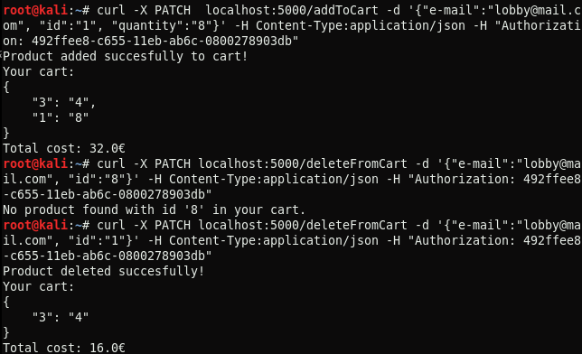

# Ergasia2_e18084
## MongoDB
Για την υλοποίηση του παρακάτω πληροφοριακού συστήματος σε Python χρησιμοποιήθηκε Flask server για την υλοποίηση του web service και MongoDB για την αποθήκευση δεδομένων.
</br>
Αρχικά, δημιουργήθηκε ένα container της MongoDB με όνομα mongodb1 με την παρακάτω εντολή:

`docker run -d -p 27017:27017 --name mongodb1 mongo:4.0.4`

Η δημιουργία της βάσης δεδομένων και των collection της έγινε αυτόματα από τον python κώδικα
```python
   client = MongoClient('mongodb://localhost:27017/') # Connect to MongoDB
   db = client['DSMarkets'] # Create database
   users = db['Users'] # Create collections
   products = db['Products'] 
```
## Web service
### Entrypoint: Create account
Με το συγκεκριμένο entrypoint γίνεται η εγγραφή ενός χρήστη στο σύστημα με το ονοματεπώνυμό του, το email του και ένα password. Γίνεται αναζήτηση του email που έδωσε ο χρήστης 
αν υπάρχει ήδη στη βάση, ως εγγρεγραμμένος, ```users.find({"e-mail":data["e-mail"]}).count() == 0 ```, ώστε να ειδοποιηθεί με κατάλληλο μήνυμα.

Αν το email δεν υπάρχει, τότε επισυνάπτεται αυτόματα στα στοιχεία του χρήστη η ένδειξη "simple user"
```python
    category = {'category':'simple user'}
    data.update(category)
```
και, τέλος, εισάγεται στην βάση, `users.insert_one(data)`.

Παρακάτω παρουσιάζεται η υλοποίηση του entrypoint. Αρχικά, για 2 χρήστες με επιτυχία και έπειτα για χρήστη με email πoυ υπάρχει ήδη στη βάση.


### Entrypoint: Login
Το entrypoint αναφέρεται στην σύνδεση χρήστη στο σύστημα. Συγκεκριμένα, ο χρήστης δίνει το email του και το password που όρισε κατά την εγγραφή του. Πραγματοποιέιται αναζήτηση 
στη βάση με αυτά `users.find_one({"e-mail":data["e-mail"], "password":data["password"]})` και αν βρεθεί ο χρήστης, τότε καλέιται η συνάρτηση create_session() με παράμετρο το 
email του χρήστη. 

Η συνάρτηση create_session() δημιουργεί έναν κωδικό αυθεντικοποίησης που επιστρέφεται στον χρήστη μετά από επιτυχημένη σύνδεση στο σύστημα ώστε να χρησιμοποιεί τις υπηρεσίες του 
super market. Αν τα στοιχεία που εισήγαγε ο χρήστης είναι λανθασμένα, επιστρέφεται κατάλληλο μήνυμα.

Παρακάτω παρουσιάζεται η υλοποίηση του endpoint. Αρχικά γίνεται επιτυχημένη σύνδεση και έπειτα δίνεται λάθος password και λάθος email.


*Για όλα τα παρακάτω endpoints απαιτείται η σύνδεση του χρήστη στο σύστημα. Για κάθε curl, εντολή εκτέλεσης, ο χρήστης δίνει τον κωδικό αυθεντικοποίησης του στο header. Ο 
κωδικός ελέγχεται με τη συνάρτηση is_session_valid() και αν δεν είναι έγκυρος επιστρέφεται κατάλληλο μήνυμα με status 401.*

### Entrypoint: Get product 
Μέσω αυτού του enrtypoint ο χρήστης μπορεί να αναζητά προϊόντα με βάση το όνομα προϊόντος, την κατηγορία του ή το μοναδικό κωδικό του. Ανάλογα με το στοιχείο που εισάγει ο 
χρήστης εκτελείται το αντίστοιχο query αναζήτησης. 

Στην περίπτωση αναζήτησης βάσει ονόματος εκτεκλείται: `products.find({'name':data["name"]})`. Αν βρεθoύν ένα ή παραπάνω προϊόντα τότε αποθηκεύονται σε πίνακα, οποίος ταξινομείται με βάση τα ονόματα των προϊόντων, `sorted(productsArray, key = lambda i: i['name'])`.

Στην περίπτωση αναζήτησης βάσει κατηγορίας εκτελείται το query `products.find({'category':data["category"]})`. Αν βρεθούν αποτελέσματα, δημιουργείται πίνακας όπου 
αποθηκέυονται τα προϊόντα και, στην συνέχεια, ταξινομείται με βάση την τιμή αυτών, `sorted(productsArray, key = lambda i: i['price'])`. 

Στην περίπτωση αναζήτησης με το id του προϊόντος, εκτελείται `products.find_one({'id':data["id"]})`. Επειδή, το id είναι μοναδικό για κάθε προιόν, επιστρέφεται πάντα ένα 
αποτέλεσμα. 

Όλα τα παραπάνω επιστρέφουν για κάθε προϊόν το όνομα, την περιγραφή, την τιμή, την κατηγορία και τον κωδικό του:
`{'name':product["name"],'description':product["description"],'price':product["price"],'category':product["category"],'id':product["id"]}` 

Επιπλέον, σε περίπτωση που δε βρεθεί κανένα προϊόν από τις παραπάνω αναζητήσεις επιστρέφεται κατάλληλο μήνυμα. 

Η υλοποίηση του entrypoint περιλαμβάνει τρεις επιμέρους αναζητήσεις:

* Με βάση όνομα προϊόντος:


* Με βάση κατηγορία προϊόντος:


* Με βάση τον κωδικό προϊόντος:


### Entrypoint: Add product to cart
Μέσω αυτού το entrypoint ο χρήστης έχει τη δυνατότητα να προσθέσει προϊόντα στο καλάθι αγορών του.

Προκειμένου να γίνει εισαγωγή προϊόντος στο καλάθι ενός χρήστης θα πρέπει εκείνος να δώσει το email του, το id του προϊόντος και την ποσότητα που επιθυμεί. Το σύστημα, αρχικά, 
αναζητά αν το προϊόν που ζήτησε ο χρήστης υπάρχει στη βάση, βάσει id που δόθηκε, `products.find_one({'id':data["id"]})`, και αν βρεθεί κάποιο προϊόν ελέγχεται αν υπάρχει αρκετό 
απόθεμα, `int(data["quantity"]) <= int(product["stock"])`, ώστε να πραγματοποιηθεί η αγορά του. Γίνεται αναζήτηση του χρήστη στην βάση, με το e-mail που έδωσε, 
`users.find_one({'e-mail':data["e-mail"]})`, ώστε να ελεγχθεί αν ο χρήστης έχει ήδη κάποια προϊότα στο καλάθι του ή αν πρόκειται για το πρώτο προϊόν που προσθέτει. 

Αν στο καλάθι υπάρχουν και άλλα προϊόντα τότε στο dictionary που τα περιέχει προστίθεται το dictionary με το νέο προϊόν ώστε να ενημερωθεί το καλάθι στη βάση διατηρώντας τα 
προϊόντα που προυπήρχαν σε αυτό.
```python
   if "cart" in user:
   user["cart"].update({product["id"]: data["quantity"]}
   users.update_one({'e-mail':data["e-mail"]},{'$set': {'cart':user["cart"]}})```
```
Έπειτα, υπολογίζεται το συνολικό κόστος των προϊόντων που περιέχονται στο καλάθι. Για κάθε προϊόν παίρνουμε την τιμή του, από το collection προϊόντων, και την ποσότητα, από το 
καλάθι του χρήστη. Το συνολικό κόστος προκύπτει αν για κάθε προϊόν πολλαπλασιάζουμε την τιμή με την ποσότητα του.
```python
   for product_id in user["cart"]:
      item = products.find_one({'id':product_id})
      price = (float)(item["price"])
      quantity = user["cart"].get(product_id)
      total_cost = total_cost + price * float(quantity)
```

Αν στο καλάθι δεν υπάρχουν άλλα προϊόντα, τότε προστίθεται μόνο αυτό αυτό το προϊόν στο καλάθι του χρήστη και υπολογίζεται το συνολικό κόστος μόνο από το κόστος αυτού.
```python
   users.update_one({'e-mail':data["e-mail"]},{'$set': {'cart':{product["id"]: data["quantity"]}}})
   item = products.find_one({'id':product["id"]})
   price = (float)(item["price"])
   quantity = data["quantity"]
   total_cost = total_cost + price * float(quantity)
```
Για της δύο παραπάνω περιπτώσεις επιστρέφεται το καλάθι του χρήστη με όλα τα προϊόντα που περιέχει ως τώρα καθώς και το συνολικό κόστους τους. 

Στην περίπτωση που το προϊόν δεν είναι διαθέσιμο λόγω αποθέματος ή δεν βρέθηκε στην βάση το id που έδωσε ο χρήστης, επισρέφεται κατάλληλο μήνυμα. 

Για την υλοποίηση του endpoint προστέθηκαν διαδοχικά τέσσερα προϊόντα στο καλάθι.


Στην συνέχεια, έγινε προσπάθεια για προσθήκη ενός προϊόντος με απόθεμα 0 και προσπάθεια για προσθήκη προϊόντος με μή έγκυρο id. 


### Entrypoint: Get cart
Με αυτό το entrypoint ο χρήστης μπορεί να δει τα προϊόντα που έχει ως τώρα στο καλάθι του και το κόστος τους.

Ο χρήστης καλείται να δώσει το email του, με το οποίο γίνεται αναζήτηση στη βάση για το καλάθι του, `user = users.find_one({'e-mail':data["e-mail"]})`. Έπειτα, για κάθε προϊόν 
στο καλάθι υπολογίζεται το κόστος του. 
```python
   for product_id in user["cart"]:
      item = products.find_one({'id':product_id})
      price = (float)(item["price"])
      quantity = user["cart"].get(product_id)
      total_cost = total_cost + price * float(quantity)
```

Για την υλοποίηση χρησιμοποιήθηκε το καλάθι με τα τέσσερα προϊόντα του προηγούμενου entrypoint.


### Entrypoint: Delete product from cart
Το entrypoint αυτό δίνει στον χρήστη την δυνατότητα να διαγράφει ένα προϊόν από το καλάθι του. 

Ο χρήστης πρέπει να καθορίζει το email του και το id του προϊόντος που θέλει να διαγράψει. Αρχικά, γίνεται έλεγχος αν υπάρχει το συγκεκριμένο προϊόν στο καλάθι του χρήστη βάσει 
του id. Αν βρεθεί, αποθηκεύεται τοπικά το καλάθι του χρήστη σε ένα dictionary και από αυτό αφαρείται το id του προϊόντος. Έπειτα, γίνεται ενημέρωση του καλαθιού στη βάση με το 
dictionary. 
```python
   new_cart = user["cart"].pop(data["id"])
   users.update_one({'e-mail':data["e-mail"]},{'$set': {'cart':new_cart}})
```

Για το νέο καλάθι του χρήστη υπολογίζεται το συνολικό κόστος των προϊόντων και επιστρέφεται το ενωμερωμένο καλάθι.
```python
   for product_id in user["cart"]:
      item = products.find_one({'id':product_id})
      price = (float)(item["price"])
      quantity = user["cart"].get(product_id)
      total_cost = total_cost + price * float(quantity)
```

Αν το προϊόν που θελει να διαγράψει ο χρήστης δεν περιέχεται στο καλάθι του, επιστρέφεται κατάλληλο μήνυμα.

Για την υλοποίηση του entrypoint έγινε εισαγωγή δύο προϊόντων σττο καλάθ ενός χρήστη και έπειτα διαγραφή του ενός από αυτά, επιπλέον αναζητήθηκε και προϊόν με id που δεν υπάρχει 
στο καλάθι.



### Entrypoint: Buy products
Με το συγκεκριμένο entrypoint ο χρήστης μπορεί να αγοράσει τα προϊόντα που έχει στο καλάθι του.

Δίνει το email του και τον αριθμό της κάρτας του. Αρχικά, ελέγχεται αν το καλάθι του έχει προϊόντα και αν ο αριθμός της κάρτας του αποτελέιται από 16 ψηφία. Σε διαφορετική 
περίπτωση επιστρέφεται μήνυμα λάθους.
```python
   if user["cart"] != {}:
      if len(data["card-number"]) == 16:
```

Στην συνέχεια, το καλάθι του χρήστη πρέπει να προστεθεί στο ιστορικά αγορών του. Αν υπάρχει ήδη κάποιο ιστορικό με προηγούμενες παραγγελίες, τότε δημιουργείται πίνακας στον 
οποίο προστίθονται οι μέχρι τώρα αγορές του χρήστη και η καινούρια. 
```python
   order = []
   if "orderHistory" in user:
      order.append(user["orderHistory"])  # store old orders
      order.append({'order':user["cart"]}) # add new order
```
Ενώ αν πρόκειται για την πρώτη του αγορά προστίθεται μόνο αυτή η παραγγελία `order = {'order':user["cart"]} # store new order`.

Και για τις δύο περιπτώσεις το ιστορικό του χρήστη ενημερώνεται με τον πίνακα παραγγελιών και έπειτα το καλάθι του αδειάζει ώστε να χρησιμοποιηθεί σε επόμενη παραγγελία.
```python
   users.update_one({'e-mail':data["e-mail"]},{'$set': {'orderHistory':order}})
   new_cart = {}
   users.update({'e-mail':data["e-mail"]},{'$set': {'cart':new_cart}})
```
Τέλος, εκτυπώνεται η απόδειξη του χρήστη, η οποία περιλαμβάνει τον κωδικό του προϊόντος, την ποσότητα που αγόρασε ο χρήστης και το κόστος κάθε προϊόντος ανάλογα των τεμαχίων που
αγόρασε, `cost = price * float(quantity)`:

`
receipt = receipt + "    "+item+ "............."+user["cart"].get(item)+"............"+str(cost)+"€\n"
`

Στον χρήστη εκτυπώνεται η απόδειξη και το συνολικό κόστος της αγοράς του.

Για την υλοποιήση έγινε η αγορά των τεσσέρων προϊόντων που προστέθηκαν στο καλάθι κατά το entrypoint <ins>Add product to cart</ins>. Αρχικά δόθηκε λάθος πλήθος ψηφίων για τιον κωδικό της 
κάρτας και έπειτα έγινε επιτυχημένη αγορά.


### Entrypoint: Get order history
### Entrypoint: Delete account
<!--admin does not login-->
### Entrypoint: Add product 
### Entrypoint: Delete product
### Entrypoint: Update product

*Τα στοιχεία των προϊόντων που χρησιμποιήθηκαν ενδεικτικά για την υλοποίηση του web service μπορούν να βρεθούν στο [DB_backup/getallproducts.json](https://github.com/MaryKroustali/Ergasia2_e18084/blob/main/DB_backup/getallproducts.json)*

*Τα στοιχεία των χρηστών που χρησιμποιήθηκαν ενδεικτικά για την υλοποίηση του web service μπορούν να βρεθούν στο [DB_backup/getallusers.json](https://github.com/MaryKroustali/Ergasia2_e18084/blob/main/DB_backup/getallusers.json)*

## Containerize
