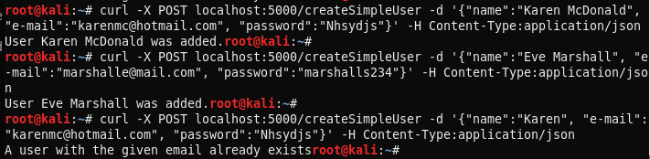

# Ergasia2_e18084
## MongoDB
Για την υλοποίηση του παρακάτω πληροφοριακού συστήματος σε Python χρησιμοποιήθηκε Flask server για την υλοποίηση του web service και MongoDB για την αποθήκευση δεδομένων.
</br>
Αρχικά, δημιουργήθηκε ένα container της MongoDB με όνομα mongodb1 με την παρακάτω εντολή:

```docker run -d -p 27017:27017 --name mongodb1 mongo:4.0.4```

Η δημιουργία της βάσης δεδομένων και των collection της έγινε αυτόματα από τον python κώδικα
```
   client = MongoClient('mongodb://localhost:27017/') # Connect to MongoDB
   db = client['DSMarkets'] # Create database
   users = db['Users'] # Create collections
   products = db['Products'] 
```
## Web service
### Entrypoint: Create account
Με το συγκεκριμένο entrypoint γίνεται η εγγραφή ενός χρήστη στο σύστημα με το ονοματεπώνυμό του, το email του και ένα password. Γίνεται αναζήτηση του email που έδωσε ο χρήστης αν υπάρχει ήδη στη βάση, ως εγγρεγραμμένος, ```users.find({"e-mail":data["e-mail"]}).count() == 0 ```, ώστε να ειδοποιηθεί με κατάλληλο μήνυμα.

Αν το email δεν υπάρχει, τότε επισυνάπτεται αυτόματα στα στοιχεία του χρήστη η ένδειξη "simple user"
``` 
    category = {'category':'simple user'}
    data.update(category)
```
και, τέλος, εισάγεται στην βάση, ```users.insert_one(data)```.

Παρακάτω παρουσιάζεται η υλοποίηση του entrypoint. Αρχικά, για 2 χρήστες με επιτυχία και έπειτα για χρήστη με email πoυ υπάρχει ήδη στη βάση.



### Entrypoint: Login
Το entrypoint αναφέρεται στην σύνδεση χρήστη στο σύστημα. Συγκεκριμένα, ο χρήστης δίνει το email του και το password που όρισε κατά την εγγραφή του. Πραγματοποιέιται αναζήτηση στη βάση με αυτά ```users.find_one({"e-mail":data["e-mail"], "password":data["password"]})``` και αν βρεθεί ο χρήστης, τότε καλέιται η συνάρτηση create_session() με παράμετρο το email του χρήστη. 

Η συνάρτηση create_session() δημιουργεί έναν μοναδικό κωδικό που επιστρέφεται στον χρήστη μετά από επιτυχημένη σύνδεση στο σύστημα ώστε να χρησιμοποιεί τις υπηεσίες του super market. Αν τα στοιχεία που εισήγαγε ο χρήστης είναι λανθασμένα, επιστρέφεται κατάλληλο μήνυμα.

Παρακάτω παρουσιάζεται η υλοποίηση του endpoint. Αρχικά γίνεται επιτυχημένη σύνδεση και έπειτα δίνεται λάθος email και λάθος password.


### Entrypoint: Get product 
### Entrypoint: Add product to cart
### Entrypoint: Get cart
### Entrypoint: Delete product from cart
### Entrypoint: Buy products
### Entrypoint: Get order history
### Entrypoint: Delete account
<!--admin does not login-->
### Entrypoint: Add product 
### Entrypoint: Delete product
### Entrypoint: Update product

## Containerize
